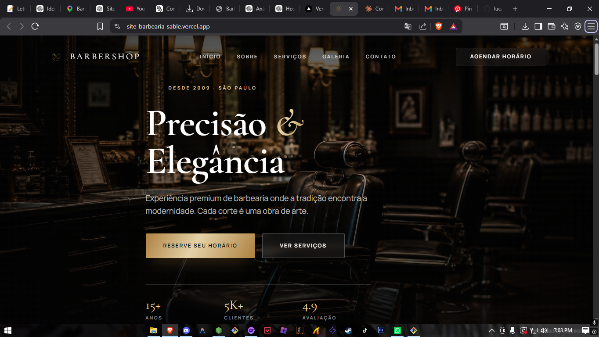

# 💈 Barbershop — Site de Barbearia (Projeto de Portfólio)



Projeto desenvolvido para portfólio, simulando o site institucional de uma barbearia premium. O objetivo foi praticar desenvolvimento front-end moderno com React, criando uma landing page completa, responsiva e com boa experiência de usuário — do primeiro contato até o agendamento do serviço.

🔗 **Demo ao vivo:** [site-barbearia-sable.vercel.app](https://site-barbearia-sable.vercel.app/)

## 📌 Sobre o projeto

O site foi pensado para resolver um problema real de pequenos negócios: ter uma presença online profissional que apresente os serviços e facilite o agendamento, sem depender só de redes sociais.

### O que o site faz

- **Apresenta a marca** — seção inicial (Hero) com identidade visual e chamada para ação
- **Conta a história do negócio** — seção "Sobre" com diferenciais e experiência
- **Exibe os serviços** — cards com nome, descrição, duração e preço de cada serviço
- **Mostra o trabalho** — galeria de fotos do ambiente e resultados
- **Permite agendar** — formulário de agendamento com seleção de serviço, data e horário
- **Facilita o contato** — endereço, telefone, redes sociais e horário de funcionamento no rodapé

## 🛠️ Tecnologias utilizadas

- [TanStack Start](https://tanstack.com/start) — framework React com SSR
- TypeScript
- Tailwind CSS
- Vite
- shadcn/ui + Radix UI (componentes acessíveis)
- Framer Motion (animações)

## 🚀 Rodando localmente

```sh
git clone https://github.com/lucasgabrielbazzotidasilva/site-barbearia.git
cd site-barbearia
npm i
npm run dev
```

## ☁️ Deploy (Vercel + GitHub)

O projeto está hospedado na [Vercel](https://vercel.com), com deploy automático via integração com este repositório GitHub: a cada `push` na branch principal, uma nova versão é publicada automaticamente.

Para hospedar sua própria cópia:

1. Faça um fork ou clone deste repositório
2. Acesse [vercel.com/new](https://vercel.com/new)
3. Clique em **Continue with GitHub** e importe o repositório
4. A Vercel detecta o framework automaticamente — clique em **Deploy**

## 🎨 Sobre a construção

Este projeto foi construído com o auxílio do [Lovable](https://lovable.dev), com ajustes e organização manual do código.

## 👤 Autor

Desenvolvido por **Lucas Gabriel Bazzoti da Silva**
Projeto criado para fins de portfólio e estudo de front-end.
